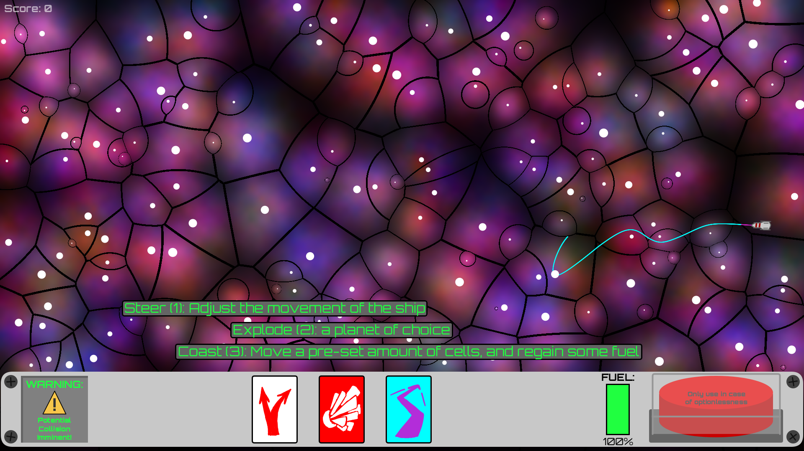
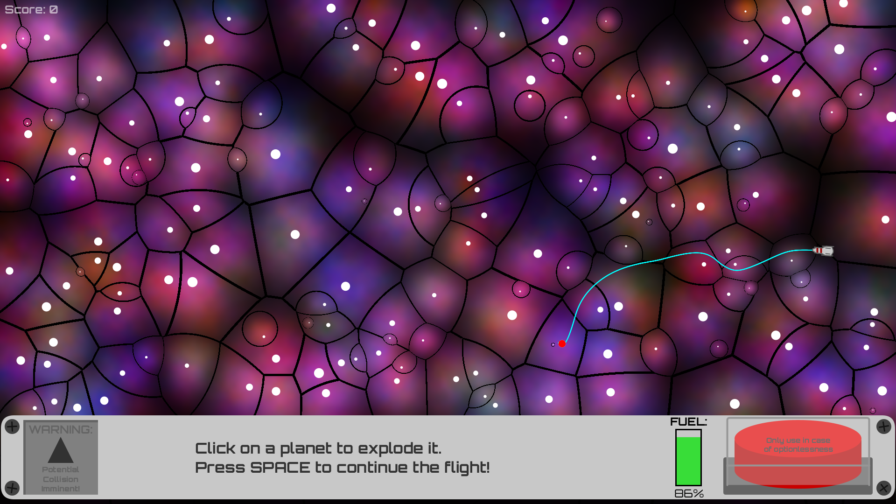
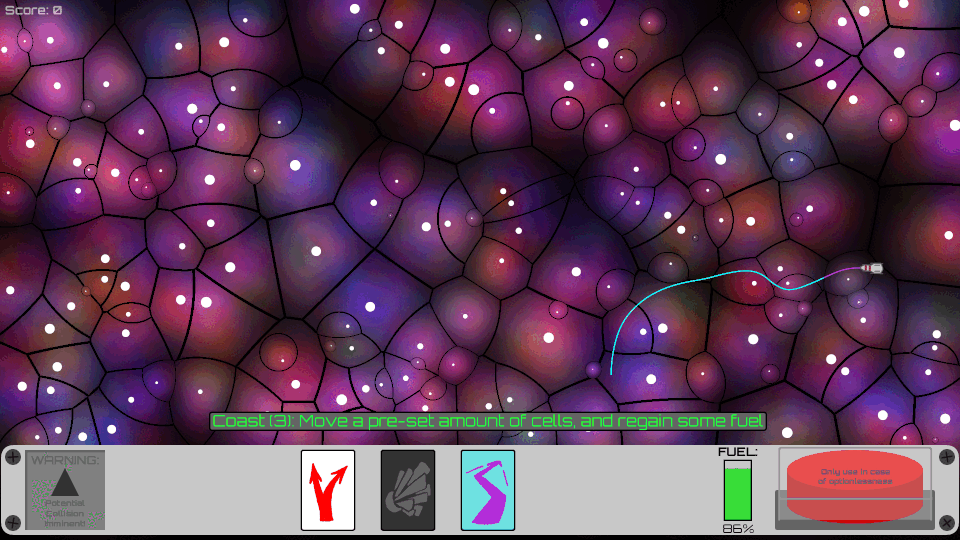

# Geodesic
_Codename: [TEA-TEB](https://en.wiktionary.org/wiki/TEA-TEB)_

 <i>Main Menu</i>

**A rogue-like survival game where you control a spacecraft
that needs to navigate through the stars.**

<i>In-Game</i>

Entry for the XP Study Association's 2025 GameJam.\
**Theme**: _OUT OF OPTIONS_

Made in **Processing 4.3 (1293)**.

## [»Download here«](../../releases/latest)
Available for _Linux_ and _Windows_.

## More screenshots

 <i>In-Game, Tooltips</i>

 <i>In-Game, Steering Movement Option</i>

 <i>In-Game, Explode Planet Option</i>

 <i>In-Game, Coast Movement Option</i>

